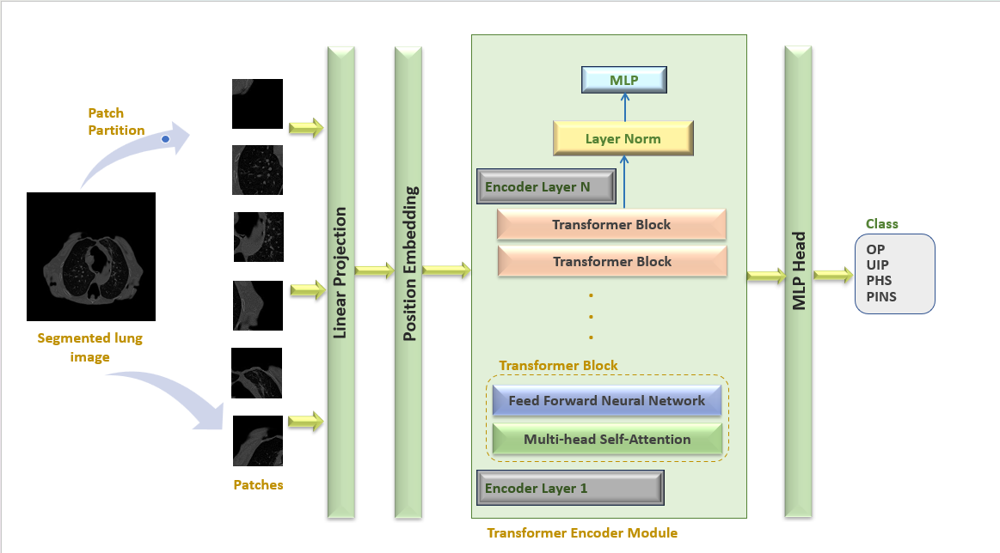
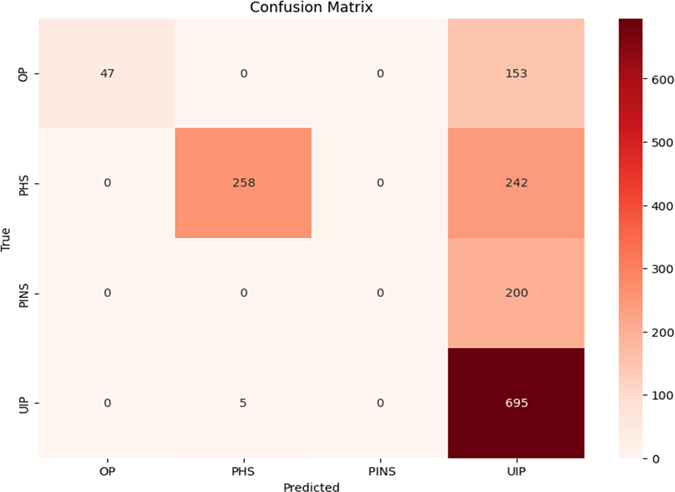

# Pulmonary Fibrosis Classification

## Description
This project focuses on the **classification of pulmonary fibrosis** using **Vision Transformers** as the primary evaluation model, along with **VGG16** and **CNN** models for comparison.  

The goal of this project is to review the **CT diagnostic criteria** for some of the most frequent interstitial lung diseases (ILDs), including:

- **Organizing Pneumonia (OP)**  
- **Pulmonary Histiocytosis (PHS)**  
- **Pneumoconiosis (PINS)**  
- **Usual Interstitial Pneumonia (UIP)**  

Each of these types has distinct characteristics, making it essential to differentiate between them accurately.  

## Dataset
The project uses **CT scan images** with a total of **6,122 images**, divided as follows:

- **Training set:** 4,522 images  
- **Testing set:** 1,600 images  

These images were used to train and evaluate the classification models.  

## Tools & Technologies

- **Environment:** Google Colab  
- **Programming Language:** Python  
- **Libraries & Frameworks:** TensorFlow, Keras, PyTorch, Torchvision, Matplotlib  

## Models 

The primary model used in this project is the **Vision Transformer (ViT)**, which serves as the main architecture for pulmonary fibrosis classification.

For comparison purposes, additional experiments were conducted using **CNN** and **VGG16** models in order to evaluate the effectiveness of transformer-based approaches.

## Evaluation Metrics
The models are evaluated using:
- Confusion Matrix  
- Accuracy  
- Precision  
- F1-Score  
- Recall  

## Optimizers
The following optimizers were tested:

- Adam (Adaptive Moment Estimation)  
- AdamW  
- Stochastic Gradient Descent (SGD)  

## Experiments

Several experiments were conducted to evaluate the impact of different training parameters on the model performance. These parameters include the number of epochs, batch size, and optimization algorithms such as Adam, AdamW, and Stochastic Gradient Descent (SGD). Adjusting these parameters allowed us to analyze how the models improve during the training process.
## Vision Transformer Architecture

## Model Results

## VGG16 Model
Confusion matrix obtained after training the VGG16 model for 10 epochs

  

## CNN Model
Confusion matrix obtained after training the CNN model for 10 epochs

## Vision Transformer (ViT) Model

Confusion matrix after 40 epochs:

## Note
The **source code is confidential** and is not publicly shared. This repository contains only project documentation and example images.  

## Author
Wissal Hlioui

Electronics Engineer – Intelligent Electronic Systems

AI Enthusiast